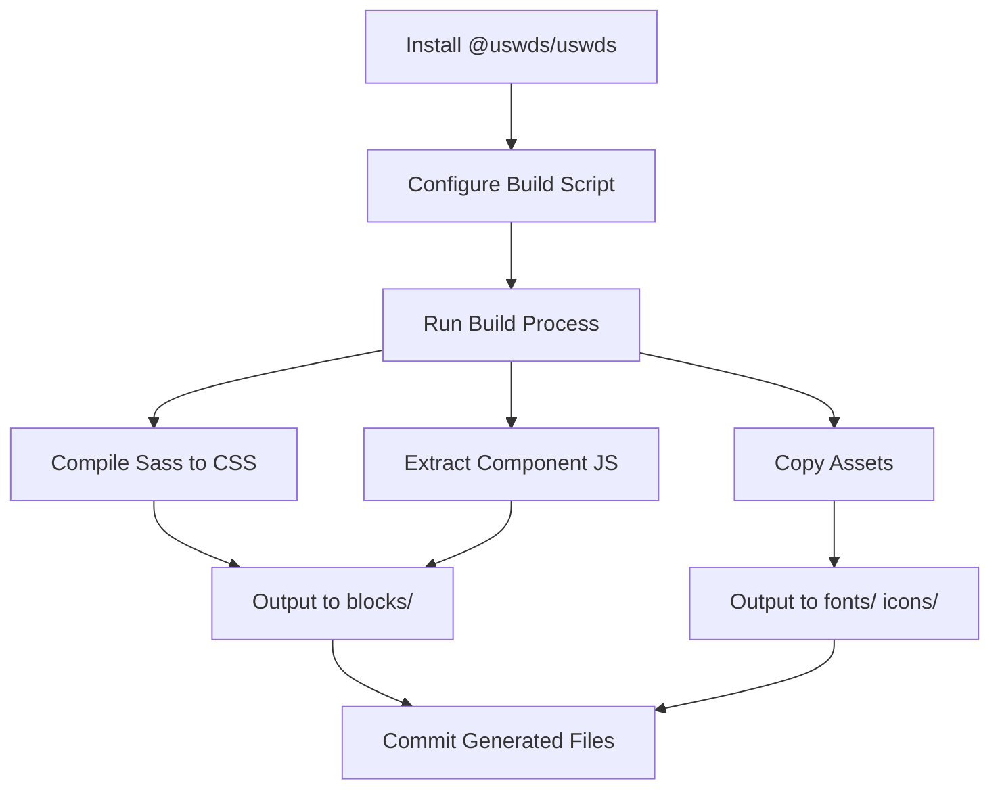

# USWDS Integration Plan for EDS

## Executive Summary

This plan outlines the integration of U.S. Web Design System (USWDS) components into an Adobe Edge Delivery Services (EDS) project. The goal is to create a maintainable, upgradeable implementation that follows EDS patterns while leveraging USWDS design standards and components.

## Table of Contents

1. [Project Goals](#project-goals)
2. [Technical Challenges](#technical-challenges)
3. [Proposed Architecture](#proposed-architecture)
4. [Build Process](#build-process)
5. [Component Mapping](#component-mapping)
6. [Implementation Phases](#implementation-phases)
7. [Upgrade Strategy](#upgrade-strategy)
8. [File Structure](#file-structure)

---

## Project Goals

### Primary Objectives

1. **USWDS Component Integration**: Implement all 47 USWDS components as EDS blocks
2. **CSS Modularity**: Separate CSS by component/block (EDS requirement)
3. **JS Modularity**: Separate JavaScript by component (EDS requirement)
4. **No Runtime Compilation**: Pre-compile USWDS Sass during development, serve static CSS
5. **Easy Upgrades**: Make USWDS version updates straightforward
6. **EDS Compatibility**: Maintain full compatibility with EDS patterns and tooling

### Non-Goals

- Server-side rendering
- Build-time compilation in production
- Monolithic CSS/JS bundles

---

## Technical Challenges

### Challenge 1: USWDS Sass Compilation

**Problem**: USWDS is distributed as Sass files that require compilation, but EDS expects pre-compiled CSS.

**Solution**: Create a development-time build process that:
- Compiles USWDS Sass during development
- Generates per-block CSS files
- Outputs to standard EDS block structure
- Can be re-run when upgrading USWDS

### Challenge 2: Monolithic vs Modular CSS

**Problem**: USWDS typically compiles to a single `uswds.css` file (~500KB), but EDS loads CSS per-block.

**Solution**: 
- Extract component-specific Sass from USWDS
- Create individual compilation targets for each component
- Include only necessary dependencies for each component
- Create a shared "core" CSS file for common styles (typography, colors, utilities)

### Challenge 3: JavaScript Modularity

**Problem**: USWDS JavaScript is modular but needs to be split per EDS block.

**Solution**:
- Import specific USWDS component JS modules
- Wrap in EDS block decorator pattern
- Maintain USWDS initialization API
- Bundle component-specific JS separately

### Challenge 4: Asset Management

**Problem**: USWDS includes fonts, icons, and images that need proper paths.

**Solution**:
- Copy USWDS assets to project structure
- Configure Sass asset paths
- Ensure proper relative paths in compiled CSS
- Document asset update process

### Challenge 5: Theme Customization

**Problem**: Need to customize USWDS to match project branding while staying upgradeable.

**Solution**:
- Use USWDS theme settings files
- Override via Sass variables before compilation
- Keep customizations in separate layer
- Document all overrides

---

## Proposed Architecture

### Layers

```
┌─────────────────────────────────────────┐
│   EDS Application Layer                 │
│   - scripts.js                          │
│   - styles.css (global)                 │
└─────────────────────────────────────────┘
              ↓
┌─────────────────────────────────────────┐
│   EDS Blocks (USWDS Components)         │
│   - blocks/button/button.js             │
│   - blocks/button/button.css            │
│   - blocks/accordion/accordion.js       │
│   - blocks/accordion/accordion.css      │
│   - ... (47 components)                 │
└─────────────────────────────────────────┘
              ↓
┌─────────────────────────────────────────┐
│   USWDS Core Layer                      │
│   - styles/uswds-core.css               │
│     (typography, colors, utilities)     │
│   - fonts/                              │
│   - icons/                              │
└─────────────────────────────────────────┘
              ↓
┌─────────────────────────────────────────┐
│   USWDS Source (npm package)            │
│   - node_modules/@uswds/uswds/          │
└─────────────────────────────────────────┘
```

### Block Structure Pattern

Each USWDS component becomes an EDS block:

```
blocks/[component-name]/
├── [component-name].js      # EDS decorator + USWDS JS
├── [component-name].css     # Compiled from USWDS Sass
└── README.md                # Component documentation
```

---

## Build Process

### Development Workflow



### Build Script Requirements

Create `scripts/build-uswds.js` that:

1. **Compiles USWDS Sass**
   ```javascript
   // For each component:
   // - Import USWDS component Sass
   // - Import dependencies
   // - Compile to CSS
   // - Write to blocks/[component]/[component].css
   ```

2. **Processes JavaScript**
   ```javascript
   // For each component:
   // - Import USWDS component JS
   // - Wrap in EDS decorator
   // - Write to blocks/[component]/[component].js
   ```

3. **Copies Assets**
   ```javascript
   // Copy fonts, icons, images
   // Update paths in CSS
   ```

4. **Generates Core Styles**
   ```javascript
   // Compile shared USWDS styles
   // - Typography system
   // - Color system
   // - Grid system
   // - Utility classes
   // Write to styles/uswds-core.css
   ```

### package.json Scripts

```json
{
  "scripts": {
    "build:uswds": "node scripts/build-uswds.js",
    "build:uswds:component": "node scripts/build-uswds.js --component=",
    "upgrade:uswds": "npm update @uswds/uswds && npm run build:uswds",
    "lint:js": "eslint .",
    "lint:css": "stylelint 'blocks/**/*.css' 'styles/*.css'",
    "lint": "npm run lint:js && npm run lint:css"
  }
}
```

### Build Configuration

Create `uswds.config.js`:

```javascript
module.exports = {
  // USWDS settings
  uswdsPath: './node_modules/@uswds/uswds',
  
  // Output paths
  blocksPath: './blocks',
  stylesPath: './styles',
  fontsPath: './fonts',
  iconsPath: './icons',
  imagesPath: './images',
  
  // Theme settings
  theme: {
    fontPath: '../fonts',
    imagePath: '../images',
    // ... other USWDS theme settings
  },
  
  // Component mapping (USWDS component → EDS block name)
  componentMap: {
    'usa-accordion': 'accordion',
    'usa-alert': 'alert',
    'usa-button': 'button',
    // ... all 47 components
  },
  
  // Components to exclude (if any)
  excludeComponents: [],
  
  // Sass compilation options
  sass: {
    includePaths: [
      './node_modules/@uswds/uswds/packages'
    ],
    outputStyle: 'expanded', // or 'compressed' for production
    autoprefixer: {
      browsers: ['> 2%', 'last 2 versions', 'not dead']
    }
  }
};
```

---

## Component Mapping

### USWDS Component → EDS Block Mapping

| USWDS Component | EDS Block Name | Priority | Notes |
|----------------|----------------|----------|-------|
| usa-accordion | accordion | High | Already exists, replace |
| usa-alert | alert | High | New |
| usa-banner | banner | High | Gov sites requirement |
| usa-breadcrumb | breadcrumb | Medium | Navigation |
| usa-button | button | High | Core component |
| usa-button-group | button-group | Medium | Layout component |
| usa-card | cards | High | Already exists, replace |
| usa-character-count | character-count | Medium | Form enhancement |
| usa-checkbox | checkbox | High | Form control |
| usa-collection | collection | Medium | Content display |
| usa-combo-box | combo-box | High | Form control |
| usa-date-picker | date-picker | High | Form control |
| usa-date-range-picker | date-range-picker | Medium | Form control |
| usa-file-input | file-input | High | Form control |
| usa-footer | footer | High | Already exists, replace |
| usa-form | form | High | Already exists, enhance |
| usa-header | header | High | Already exists, replace |
| usa-icon | icon | High | Core component |
| usa-icon-list | icon-list | Medium | Content display |
| usa-identifier | identifier | High | Gov sites requirement |
| usa-in-page-navigation | in-page-nav | Medium | Navigation |
| usa-input-mask | input-mask | Medium | Form enhancement |
| usa-input-prefix-suffix | input-prefix-suffix | Medium | Form enhancement |
| usa-language-selector | language-selector | Low | Internationalization |
| usa-link | link | High | Core component |
| usa-list | list | Medium | Content display |
| usa-memorable-date | memorable-date | Medium | Form control |
| usa-modal | modal | High | Already exists, replace |
| usa-pagination | pagination | High | Navigation |
| usa-process-list | process-list | Medium | Content display |
| usa-prose | prose | Medium | Content display |
| usa-radio | radio | High | Form control |
| usa-range | range-slider | Medium | Form control |
| usa-search | search | High | Already exists, replace |
| usa-select | select | High | Form control |
| usa-side-navigation | side-nav | Medium | Navigation |
| usa-site-alert | site-alert | High | Content display |
| usa-step-indicator | step-indicator | Medium | Progress display |
| usa-summary-box | summary-box | Medium | Content display |
| usa-table | table | High | Already exists, replace |
| usa-tag | tag | Medium | Content display |
| usa-text-input | text-input | High | Form control |
| usa-time-picker | time-picker | Medium | Form control |
| usa-tooltip | tooltip | Medium | Enhancement |
| usa-validation | validation | High | Form feature |

### Dependency Analysis

**Core Dependencies** (needed by many components):
- Typography system
- Color system
- Spacing utilities
- Grid system
- Focus styles
- Media query mixins

**Shared Components** (used by other components):
- usa-button → used by forms, modals, etc.
- usa-icon → used by buttons, alerts, etc.
- usa-link → used throughout

### Component Grouping Strategy

Group components by dependency level for build optimization:

1. **Foundation** (no dependencies)
   - Typography
   - Colors
   - Spacing
   - Grid

2. **Core Components** (foundation only)
   - Button
   - Link
   - Icon
   - List

3. **Form Controls** (core components)
   - Text Input
   - Select
   - Checkbox
   - Radio
   - etc.

4. **Complex Components** (multiple dependencies)
   - Header
   - Footer
   - Modal
   - Date Picker
   - etc.

---

## Implementation Phases

### Phase 1: Foundation Setup (Week 1)

**Goals**: Set up build infrastructure

**Tasks**:
1. Install USWDS npm package
2. Create build script structure
3. Configure Sass compilation
4. Set up asset copying
5. Create USWDS core CSS
6. Test basic compilation
7. Document build process

**Deliverables**:
- `scripts/build-uswds.js` working
- `uswds.config.js` configured
- `styles/uswds-core.css` generated
- Assets (fonts, icons) copied
- Documentation

**Testing**:
- Build script runs without errors
- CSS compiles correctly
- Assets accessible at correct paths
- Core styles load in browser

### Phase 2: Core Components (Week 2)

**Goals**: Implement high-priority, foundation components

**Components** (8):
1. Button
2. Link
3. Icon
4. Typography
5. List
6. Alert
7. Banner
8. Tag

**For each component**:
1. Create block directory
2. Extract USWDS Sass
3. Compile to block CSS
4. Wrap USWDS JS in EDS decorator
5. Create test page
6. Document usage

**Deliverables**:
- 8 working blocks
- Test pages for each
- Updated build script
- Component documentation

### Phase 3: Form Controls (Week 3)

**Goals**: Implement form components

**Components** (12):
1. Text Input
2. Select
3. Checkbox
4. Radio
5. File Input
6. Character Count
7. Input Prefix/Suffix
8. Input Mask
9. Memorable Date
10. Validation
11. Form (wrapper)
12. Combo Box

**Additional Work**:
- Form validation integration
- Accessibility testing
- Cross-browser testing

**Deliverables**:
- 12 form blocks
- Form examples page
- Validation documentation
- Accessibility notes

### Phase 4: Navigation & Layout (Week 4)

**Goals**: Implement navigation and structural components

**Components** (10):
1. Header
2. Footer
3. Breadcrumb
4. Side Navigation
5. In-Page Navigation
6. Pagination
7. Identifier
8. Step Indicator
9. Button Group
10. Search

**Additional Work**:
- Responsive testing
- Navigation patterns documentation

**Deliverables**:
- 10 navigation/layout blocks
- Template examples
- Responsive documentation

### Phase 5: Content Display (Week 5)

**Goals**: Implement content and data display components

**Components** (10):
1. Accordion (replace existing)
2. Cards (replace existing)
3. Table (replace existing)
4. Collection
5. Icon List
6. Process List
7. Prose
8. Summary Box
9. Site Alert
10. Modal (replace existing)

**Deliverables**:
- 10 content blocks
- Content pattern examples
- Migration guide for replaced blocks

### Phase 6: Advanced Components (Week 6)

**Goals**: Implement complex, interactive components

**Components** (7):
1. Date Picker
2. Date Range Picker
3. Time Picker
4. Range Slider
5. Tooltip
6. Language Selector
7. Combo Box (if not in Phase 3)

**Additional Work**:
- JavaScript testing
- Performance optimization
- Bundle size analysis

**Deliverables**:
- 7 advanced blocks
- Performance report
- JavaScript documentation

### Phase 7: Testing & Documentation (Week 7)

**Goals**: Comprehensive testing and documentation

**Tasks**:
1. Cross-browser testing (Chrome, Firefox, Safari, Edge)
2. Mobile responsiveness testing
3. Accessibility audit (WCAG 2.1 AA)
4. Performance testing (Lighthouse)
5. Create component showcase
6. Write developer documentation
7. Write author documentation
8. Create upgrade guide

**Deliverables**:
- Test reports
- Accessibility compliance report
- Performance benchmarks
- Complete documentation
- Component library showcase

### Phase 8: Polish & Launch (Week 8)

**Goals**: Final refinements and project launch

**Tasks**:
1. Bug fixes from testing
2. Code cleanup and optimization
3. Final documentation review
4. Create starter templates
5. Set up CI/CD for builds
6. Create example site
7. Write blog post/announcement

**Deliverables**:
- Production-ready codebase
- Starter templates
- Example site
- Launch announcement

---

## Upgrade Strategy

### Version Management

**USWDS Version Tracking**:
- Document current USWDS version in README
- Track in `package.json`
- Create `USWDS-VERSION.md` with version history

### Upgrade Process

When new USWDS version is released:

1. **Review Release Notes**
   ```bash
   # Check what changed
   npm info @uswds/uswds
   ```

2. **Update Package**
   ```bash
   npm update @uswds/uswds
   ```

3. **Rebuild Components**
   ```bash
   npm run build:uswds
   ```

4. **Test Changes**
   - Run automated tests
   - Visual regression testing
   - Review compiled CSS changes
   - Check for breaking changes

5. **Update Documentation**
   - Update version references
   - Document breaking changes
   - Update migration guide if needed

6. **Commit Changes**
   ```bash
   git add .
   git commit -m "chore: upgrade USWDS to vX.Y.Z"
   ```

### Breaking Change Handling

If USWDS introduces breaking changes:

1. Review breaking changes in release notes
2. Update build scripts if needed
3. Update component implementations
4. Test affected components
5. Document migration path for projects
6. Consider creating migration script

### Customization Maintenance

To maintain customizations across upgrades:

1. Keep all custom styles in separate files
2. Use USWDS theme variables when possible
3. Document why custom overrides exist
4. Review custom styles after each upgrade
5. Try to upstream useful changes to USWDS

---

## File Structure

### Proposed Directory Structure

```
/Users/foxx/AEM/Demo/USWDS/EDS/uswds/
├── .github/
│   └── workflows/
│       ├── main.yaml
│       └── uswds-build.yaml          # New: CI for USWDS builds
├── blocks/
│   ├── accordion/
│   │   ├── accordion.css              # USWDS compiled
│   │   ├── accordion.js               # USWDS + EDS wrapper
│   │   └── README.md
│   ├── alert/                         # New
│   │   ├── alert.css
│   │   ├── alert.js
│   │   └── README.md
│   ├── banner/                        # New
│   │   ├── banner.css
│   │   ├── banner.js
│   │   └── README.md
│   ├── button/                        # New
│   │   ├── button.css
│   │   ├── button.js
│   │   └── README.md
│   └── ... (47 total components)
├── fonts/
│   ├── public-sans/                   # USWDS fonts
│   │   ├── public-sans-regular.woff2
│   │   ├── public-sans-bold.woff2
│   │   └── ...
│   ├── merriweather/
│   ├── roboto-mono/
│   └── source-sans-pro/
├── icons/
│   ├── usa-icons/                     # USWDS icons
│   │   ├── add.svg
│   │   ├── remove.svg
│   │   └── ... (100+ icons)
│   └── sprite.svg                     # USWDS icon sprite
├── images/
│   └── uswds/                         # USWDS images
│       └── ... (component images)
├── scripts/
│   ├── aem.js
│   ├── scripts.js
│   ├── build-uswds.js                 # New: Build script
│   ├── build-uswds/                   # New: Build modules
│   │   ├── compile-sass.js
│   │   ├── process-js.js
│   │   ├── copy-assets.js
│   │   └── generate-core.js
│   └── uswds-helpers.js               # New: USWDS utilities
├── styles/
│   ├── styles.css                     # Global styles
│   ├── fonts.css
│   ├── lazy-styles.css
│   ├── uswds-core.css                 # New: USWDS foundation
│   ├── uswds-utilities.css            # New: USWDS utilities
│   └── uswds-theme/                   # New: Theme overrides
│       ├── _theme-settings.scss       # USWDS settings
│       ├── _theme-custom.scss         # Project overrides
│       └── _theme-tokens.scss         # Custom tokens
├── node_modules/
│   └── @uswds/uswds/                  # USWDS source
├── package.json                       # Updated with USWDS
├── uswds.config.js                    # New: USWDS build config
├── USWDS-INTEGRATION-PLAN.md          # This document
├── USWDS-VERSION.md                   # New: Version tracking
├── USWDS-UPGRADE-GUIDE.md             # New: Upgrade instructions
└── README.md                          # Updated
```

### Key Files to Create

1. **`uswds.config.js`** - Build configuration
2. **`scripts/build-uswds.js`** - Main build script
3. **`scripts/build-uswds/`** - Build modules
4. **`styles/uswds-core.css`** - Core USWDS styles
5. **`styles/uswds-utilities.css`** - Utility classes
6. **`styles/uswds-theme/`** - Theme customization
7. **`USWDS-VERSION.md`** - Version tracking
8. **`USWDS-UPGRADE-GUIDE.md`** - Upgrade instructions
9. **`.github/workflows/uswds-build.yaml`** - CI/CD

### Files to Update

1. **`package.json`** - Add USWDS and build dependencies
2. **`README.md`** - Document USWDS integration
3. **`head.html`** - Include USWDS core CSS
4. **`scripts/scripts.js`** - Include USWDS initialization
5. **`styles/styles.css`** - Import USWDS core

---

## Technical Decisions

### CSS Strategy: Hybrid Approach

**Decision**: Use a hybrid CSS approach

**Rationale**:
- **Core CSS** (`uswds-core.css`): Shared USWDS foundation (~50-100KB)
  - Typography system
  - Color tokens
  - Spacing utilities
  - Grid system
  - Focus styles
  
- **Block CSS**: Component-specific styles (~5-20KB each)
  - Compiled from USWDS component Sass
  - Include only component-specific rules
  - Assume core CSS is loaded

**Benefits**:
- Reduces duplicate CSS across blocks
- Maintains EDS per-block loading pattern
- Smaller individual block CSS files
- Core CSS can be cached globally

**Tradeoffs**:
- Requires loading core CSS globally (adds ~50-100KB to all pages)
- Slightly more complex build process
- Need to carefully split core vs. component CSS

### JavaScript Strategy: Wrapped Modules

**Decision**: Wrap USWDS JavaScript in EDS decorators

**Pattern**:
```javascript
// blocks/accordion/accordion.js
import accordion from '@uswds/uswds/js/usa-accordion';

export default function decorate(block) {
  // 1. Transform EDS block markup to USWDS HTML structure
  // ... EDS-specific transformation ...
  
  // 2. Initialize USWDS component
  accordion.on(block);
  
  // 3. Return cleanup function if needed
  return () => accordion.off(block);
}
```

**Benefits**:
- Maintains EDS decorator pattern
- Uses official USWDS JavaScript
- Easy to upgrade USWDS
- Clean separation of concerns

### Asset Strategy: Copy to Project

**Decision**: Copy USWDS assets to project structure during build

**Rationale**:
- Ensures correct paths in compiled CSS
- Makes project self-contained
- Simplifies deployment
- No runtime dependency resolution

**Process**:
1. Build script copies fonts, icons, images from USWDS
2. Updates paths in compiled CSS
3. Assets become part of project repository

### Build Strategy: Development-Time Only

**Decision**: Build/compile only during development, commit generated files

**Rationale**:
- EDS expects static CSS/JS files
- No build step in production
- Simpler deployment
- Generated files are version controlled

**When to build**:
- Initial project setup
- After USWDS version upgrade
- When adding new components
- When changing theme settings

---

## Dependencies

### Required npm Packages

```json
{
  "dependencies": {
    "@uswds/uswds": "^3.13.0"
  },
  "devDependencies": {
    "@babel/eslint-parser": "7.24.8",
    "eslint": "8.57.0",
    "eslint-config-airbnb-base": "15.0.0",
    "eslint-plugin-import": "2.29.1",
    "stylelint": "16.7.0",
    "stylelint-config-standard": "36.0.1",
    "sass": "^1.70.0",
    "autoprefixer": "^10.4.17",
    "postcss": "^8.4.33",
    "postcss-cli": "^11.0.0",
    "fs-extra": "^11.2.0",
    "glob": "^10.3.10",
    "chalk": "^5.3.0"
  }
}
```

### Build Tool Dependencies

- **sass**: Compile USWDS Sass to CSS
- **postcss**: Post-process CSS
- **autoprefixer**: Add vendor prefixes
- **fs-extra**: File operations
- **glob**: File pattern matching
- **chalk**: Terminal colors (for build output)

---

## Testing Strategy

### Unit Tests

**JavaScript**:
- Test each block decorator function
- Test USWDS component initialization
- Test EDS/USWDS integration points

**CSS**:
- Visual regression testing
- Lint for errors
- Check for unused styles

### Integration Tests

**Browser Testing**:
- Chrome (latest)
- Firefox (latest)
- Safari (latest)
- Edge (latest)

**Device Testing**:
- Desktop (1920x1080, 1366x768)
- Tablet (768x1024)
- Mobile (375x667, 414x896)

### Accessibility Testing

**Tools**:
- axe DevTools
- WAVE
- ANDI
- Keyboard navigation testing
- Screen reader testing (NVDA, JAWS, VoiceOver)

**Standards**:
- WCAG 2.1 Level AA
- Section 508

### Performance Testing

**Metrics**:
- First Contentful Paint (FCP)
- Largest Contentful Paint (LCP)
- Total Blocking Time (TBT)
- Cumulative Layout Shift (CLS)

**Tools**:
- Lighthouse
- WebPageTest
- Chrome DevTools Performance panel

**Targets**:
- LCP < 2.5s
- FCP < 1.8s
- TBT < 300ms
- CLS < 0.1

---

## Risk Assessment

### High-Risk Items

1. **Build Complexity**
   - **Risk**: Build script becomes too complex to maintain
   - **Mitigation**: Keep script modular, document thoroughly, include examples
   - **Fallback**: Manual component conversion process

2. **CSS Size**
   - **Risk**: Total CSS size too large for good performance
   - **Mitigation**: Monitor bundle sizes, use tree-shaking, minimize core CSS
   - **Fallback**: More aggressive component splitting

3. **USWDS Breaking Changes**
   - **Risk**: Major USWDS update breaks integration
   - **Mitigation**: Pin USWDS version, test upgrades in branch, document workarounds
   - **Fallback**: Stay on working USWDS version until fixed

### Medium-Risk Items

1. **JavaScript Bundle Size**
   - **Risk**: Per-block JS files too large
   - **Mitigation**: Use tree-shaking, minimize dependencies
   - **Fallback**: Lazy load some components

2. **Asset Management**
   - **Risk**: Asset paths break or become inconsistent
   - **Mitigation**: Automated testing, path validation in build
   - **Fallback**: Manual path correction

3. **Browser Compatibility**
   - **Risk**: USWDS features don't work in older browsers
   - **Mitigation**: Use USWDS-supported browser list, test thoroughly
   - **Fallback**: Polyfills or graceful degradation

### Low-Risk Items

1. **Theme Customization**
   - **Risk**: Custom styles conflict with USWDS updates
   - **Mitigation**: Use USWDS theme variables, document overrides
   - **Fallback**: Review and fix conflicts manually

2. **Documentation**
   - **Risk**: Documentation becomes outdated
   - **Mitigation**: Update docs with each change, include in PR checklist
   - **Fallback**: Periodic documentation audits

---

## Success Metrics

### Quantitative Metrics

- **Component Coverage**: 47/47 USWDS components implemented (100%)
- **Accessibility**: WCAG 2.1 AA compliance (100%)
- **Performance**: Lighthouse score > 90 (all categories)
- **Browser Support**: 100% functionality in supported browsers
- **Bundle Size**: Individual block CSS < 30KB, JS < 50KB
- **Build Time**: Full rebuild < 60 seconds

### Qualitative Metrics

- **Developer Experience**: Easy to add new components
- **Maintainability**: Clear, well-documented code
- **Upgradeability**: USWDS upgrades take < 1 hour
- **Author Experience**: Intuitive block usage in AEM
- **Code Quality**: Passes all linters, follows best practices

---

## Open Questions

1. **Which USWDS theme should be the default?**
   - Default USWDS theme
   - Custom agency theme
   - Minimal theme (let projects customize)

2. **Should we include USWDS utility classes?**
   - All utilities (increases bundle size)
   - Common utilities only
   - No utilities (blocks only)

3. **How to handle USWDS grid system?**
   - Use USWDS grid throughout
   - Use existing EDS section/block pattern
   - Hybrid approach

4. **Should we version control generated files?**
   - Yes (simpler deployment, visible diffs)
   - No (cleaner repo, run build on deploy)

5. **How to handle responsive images?**
   - Use EDS picture element
   - Use USWDS responsive image approach
   - Hybrid based on context

6. **Should we create a separate npm package?**
   - Keep as template repository
   - Publish as npm package
   - Both (package + template)

---

## Next Steps

### Immediate Actions (Week 1)

1. **Stakeholder Review**
   - Present this plan to team
   - Gather feedback
   - Answer open questions
   - Get approval to proceed

2. **Environment Setup**
   - Create development branch
   - Install dependencies
   - Set up build infrastructure
   - Create sample component

3. **Documentation**
   - Create CONTRIBUTING.md
   - Create developer setup guide
   - Create component template
   - Set up project board

### First Sprint (Weeks 1-2)

- Complete Phase 1 (Foundation Setup)
- Complete Phase 2 (Core Components)
- Weekly check-in meetings
- Iterative feedback and adjustments

---

## Appendix

### Appendix A: USWDS Resources

- **USWDS Website**: https://designsystem.digital.gov
- **USWDS GitHub**: https://github.com/uswds/uswds
- **USWDS npm**: https://www.npmjs.com/package/@uswds/uswds
- **USWDS Documentation**: https://designsystem.digital.gov/documentation/
- **USWDS Components**: https://designsystem.digital.gov/components/overview/

### Appendix B: EDS Resources

- **EDS Documentation**: https://www.aem.live/developer/
- **EDS Block Collection**: https://www.aem.live/developer/block-collection
- **EDS Tutorial**: https://www.aem.live/developer/tutorial

### Appendix C: Example Build Script Pseudocode

```javascript
// scripts/build-uswds.js (pseudocode)

const config = require('../uswds.config');
const sass = require('sass');
const autoprefixer = require('autoprefixer');
const postcss = require('postcss');
const fs = require('fs-extra');

async function buildUSWDS() {
  console.log('Building USWDS components...');
  
  // 1. Build core styles
  await buildCore();
  
  // 2. Build each component
  for (const [uswdsName, blockName] of Object.entries(config.componentMap)) {
    await buildComponent(uswdsName, blockName);
  }
  
  // 3. Copy assets
  await copyAssets();
  
  console.log('Build complete!');
}

async function buildCore() {
  // Compile USWDS core Sass
  const sassContent = `
    @use "uswds-core" with (
      $theme-font-path: "${config.theme.fontPath}",
      $theme-image-path: "${config.theme.imagePath}"
    );
    
    // Include only core features
    @include uswds-core.base;
    @include uswds-core.typography;
    @include uswds-core.colors;
    @include uswds-core.utilities;
  `;
  
  const result = sass.compileString(sassContent, {
    loadPaths: config.sass.includePaths
  });
  
  const processed = await postcss([autoprefixer]).process(result.css);
  await fs.writeFile(`${config.stylesPath}/uswds-core.css`, processed.css);
}

async function buildComponent(uswdsName, blockName) {
  const blockDir = `${config.blocksPath}/${blockName}`;
  await fs.ensureDir(blockDir);
  
  // Compile Sass
  await buildComponentCSS(uswdsName, blockName, blockDir);
  
  // Process JavaScript
  await buildComponentJS(uswdsName, blockName, blockDir);
  
  // Create README
  await buildComponentReadme(uswdsName, blockName, blockDir);
}

// ... more functions ...
```

### Appendix D: Example Component Code

#### Button Block Example

```javascript
// blocks/button/button.js
import button from '@uswds/uswds/js/usa-button';

export default function decorate(block) {
  // EDS creates buttons from links
  // USWDS expects specific button classes
  
  const buttons = block.querySelectorAll('a.button');
  
  buttons.forEach((btn) => {
    // Add USWDS classes
    btn.classList.add('usa-button');
    
    // Check for modifiers from EDS
    if (btn.classList.contains('secondary')) {
      btn.classList.add('usa-button--secondary');
    }
    if (btn.classList.contains('big')) {
      btn.classList.add('usa-button--big');
    }
  });
  
  // Initialize USWDS button behavior (if any)
  button.on(block);
}
```

```css
/* blocks/button/button.css */
/* Compiled from USWDS Sass */

.usa-button {
  /* USWDS button styles */
  appearance: none;
  background-color: #005ea2;
  border: 0;
  border-radius: 0.25rem;
  color: white;
  cursor: pointer;
  display: inline-block;
  font-family: 'Public Sans Web', -apple-system, BlinkMacSystemFont, 'Segoe UI', Roboto, Helvetica, Arial, sans-serif;
  font-size: 1.06rem;
  font-weight: 700;
  line-height: 0.9;
  margin-right: 0.5rem;
  padding: 0.75rem 1.25rem;
  text-align: center;
  text-decoration: none;
}

.usa-button:hover {
  background-color: #1a4480;
  border-bottom: 0;
  color: white;
  text-decoration: none;
}

/* ... more USWDS button styles ... */
```

---

## Conclusion

This plan provides a comprehensive roadmap for integrating USWDS components into an EDS project. The approach balances the need for USWDS design standards with EDS architectural requirements, creating a maintainable, upgradeable, and performant implementation.

**Key Takeaways**:

1. **Build Process**: Development-time Sass compilation outputs static CSS/JS per EDS requirements
2. **Modularity**: Each USWDS component becomes a separate EDS block with its own CSS/JS
3. **Upgradeability**: Simple npm update + rebuild process for USWDS upgrades
4. **Performance**: Shared core CSS + per-block CSS minimizes bundle size
5. **Standards**: Full USWDS compliance + EDS patterns + government accessibility requirements

**Timeline**: 8 weeks for full implementation (47 components + testing + documentation)

**Team**: This can be accomplished by a small team (2-3 developers) or single developer with appropriate timeline adjustments.

---

*Document Version: 1.0*  
*Date: January 27, 2026*  
*Author: AI Assistant*
